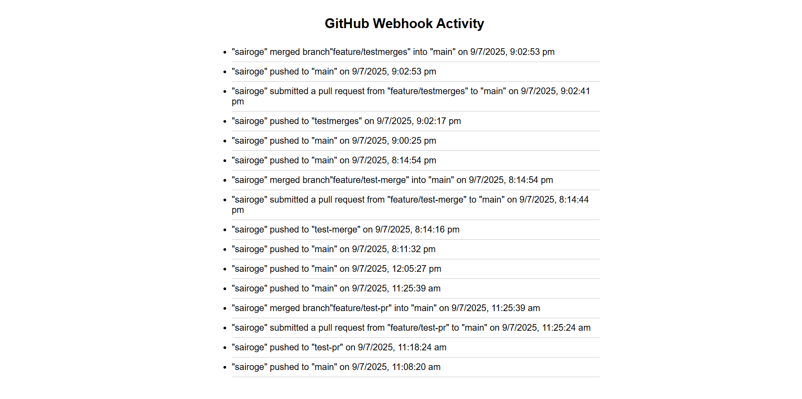

# GitHub Webhook Receiver – Techstax Full Stack Developer Assignment

This project receives GitHub webhook events (push, pull request, and merge), stores them in MongoDB, and displays them on a live updating frontend using Flask.

*******************


## 🎯 Features

- Accepts GitHub webhook events:
  - `push`
  - `pull_request` (opened)
  - `merge` (closed & merged)
- Stores data in MongoDB
- `/events` API returns all events
- Frontend UI refreshes every 15 seconds to show new activity
- Uses IST (Indian Standard Time) for accurate local timestamps

*******************

## 📦 Tech Stack

- **Backend**: Flask (Python)
- **Database**: MongoDB (PyMongo)
- **Frontend**: HTML + JavaScript
- **Tunneling**: Ngrok
- **Version Control**: Git + GitHub

*******************

*## ⚙️ Setup Instructions

### 1. Clone this Repository

```bash
git clone https://github.com/<your-username>/webhook-repo.git
cd webhook-repo
```
### 2. Create and Activate Virtual Environment

```bash
python -m venv venv
venv\Scripts\activate    
```

### 3. Install Dependencies
```bash
pip install -r requirements.txt
```
### 4. Start MongoDB
Make sure MongoDB is running on localhost:27017
Use:

```bash
net start MongoDB   # If installed as a service
```
### 5. Run the Flask App
```bash
python run.py
```

The server starts at:
http://localhost:5000

🌍 Expose Localhost Using Ngrok
To receive GitHub webhook calls from your local machine:

```bash
ngrok http 5000
Copy the HTTPS URL (e.g. https://abc123.ngrok.io)
```

🧪 GitHub Webhook Setup
Go to action-repo > Settings > Webhooks > Add webhook

Set:

Field	Value
Payload URL	https://abc123.ngrok.io/webhook
Content type	application/json
Events	Select push, pull_request

*************
## 📂 API Endpoints

| Method | Endpoint     | Description                        |
|--------|--------------|------------------------------------|
| POST   | `/webhook`   | Receives GitHub webhooks           |
| GET    | `/events`    | Lists all stored events            |
| GET    | `/`          | Frontend UI that polls /events     |
*************

## 🖼️ Final result


*******************
